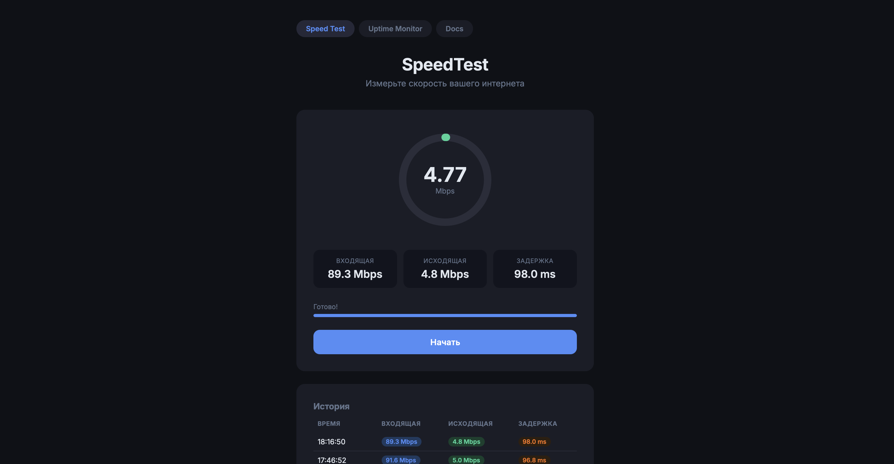
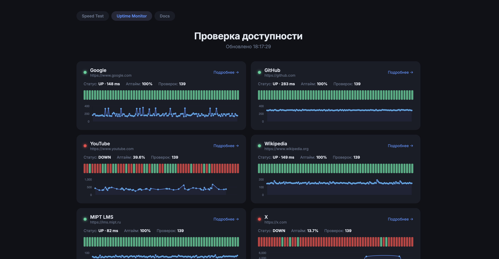

# NetworkUtils

В связи с нередкими проблемами с интернетом у себя дома я реализовал два часто используемых мною инструмента - SpeedTest (если виноват провайдер) и Uptime Monitor (если виноват не провайдер):
https://networkutils.mooo.com

---

### Полная документация доступна на самом сайте: https://networkutils.mooo.com/docs

- Принцип работы и функционал
- Как развернуть проект у себя
- API
- Технологии

---

Сервер развернут на [Yandex Cloud](https://yandex.cloud/ru), домен взят на [freedns.afraid.org](https://freedns.afraid.org/domain/registry/), сертификат получен через [Let's encrypt](https://letsencrypt.org/), все контейнеризировано 

По поводу индексации страниц Яндекс и Гугл еще не ответили

